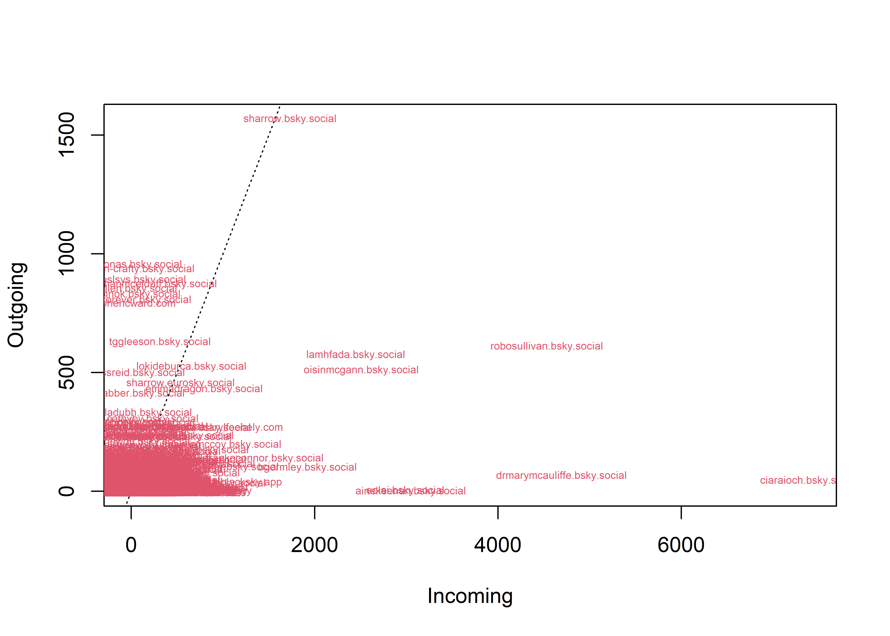

::: {.cell}
::: {.cell-output .cell-output-stderr}

```
here() starts at L:/Source/Repos/BlueSkyNetWorks/docs
```


:::

::: {.cell-output .cell-output-stderr}

```
knitr root.dir set to: L:\Source\Repos\BlueSkyNetWorks
```


:::
:::


---
title: "Speirgorm Bluesky Network Analysis"
format:
  html:
    toc: true
    number-sections: true
    css: styles.css
---

This is a Quarto web site showing an R-based social network analysis project that collects, processes, and analyses interaction data from the [Bluesky](https://bsky.app/) social media platform. The project downloads discussions around the **#Speirgorm** hashtag, constructing directed networks of reposts for graph-theoretic analysis, community detection, and NLP-based post analysis.

A side project was getting RevoScaleR working with SQL 2025 and "R version 4.6.0 (2026-04-24 ucrt)", the instructions for installing RevoScaleR are to be found [here](https://learn.microsoft.com/en-us/sql/machine-learning/install/sql-machine-learning-services-windows-install-sql-2022?view=sql-server-ver17 "Install SQL ML services on SQL 2022")

## **Overview**

The pipeline:

1.  Queries the Bluesky API for posts matching `#Speirgorm`

2.  Hydrates each post with repost and reply thread data

3.  Ingests raw data into a SQL Server graph database, using ODBC and RevoScaleR

4.  Builds directed network graphs and computes centrality metrics

5.  Exports interactive and static visualisations

6.  Runs sentiment-based and topic NLP analysis

## **Project Structure**


::: {.cell}

:::


```         
BlueSkyNetWorks/ 
├── master_pipeline.R               # Orchestrates all pipeline stages 
├── 0_functions.R                   # Libraries, authentication, utility functions 
├── 1_BlueSky_Robust.r              # API data collection and hydration 
├── 2_load network data into SQL.r  # SQL Server ingestion and graph table setup 
├── 3_build_graph_and_metrics.R     # igraph/statnet construction and metrics    
├── 4_visualisation.R               # visNetwork, ggraph, GEXF export 
├── 5_NLP_analysis.R                # TidyText NLP and post frequency analysis 
├── 6_TextAnalysis.R                # Sentiment lexicon analysis (Bing, NRC, AFINN) 
├── SQL/                            # T-SQL schema, stored procedures, views 
├── data/                           # Parquet and CSV data artifacts 
├── graphs/                         # Exported graph files (Parquet, GEXF, GraphML, SVG, HTML)
```

# Load the Network Data


::: {.cell}
::: {.cell-output .cell-output-stdout}

```
Graph summary:
```


:::

::: {.cell-output .cell-output-stdout}

```
IGRAPH a5f98f9 DNW- 19854 89888 -- 
+ attr: name (v/c), earliestPost (v/c), latestPost (v/c),
| posts_authored (v/n), reposts_made (v/n), reposts_received (v/n),
| total_likes_on_posts (v/n), total_replies_on_posts (v/n),
| total_bookmarks_on_posts (v/n), betweenness (v/n), betweenness_norm
| (v/n), closeness (v/n), closeness_norm (v/n), eigenvector_centrality
| (v/n), pagerank (v/n), pagerank_norm (v/n), hub_score (v/n),
| authority_score (v/n), authority_norm (v/n), local_clustering (v/n),
| kcore (v/n), in_degree (v/n), out_degree (v/n), total_degree (v/n),
| community (v/n), modularity (v/n), influence_score (v/n), repost_uri
| (e/c), created_at (e/c), like_count (e/n), reply_count (e/n),
| bookmark_count (e/n), repost_count (e/n), betweenness (e/n), weight
| (e/n), edgeStarts (e/c), edgeEnds (e/c), text (e/c)
IGRAPH a5f98f9 DNW- 19854 89888 -- 
+ attr: name (v/c), earliestPost (v/c), latestPost (v/c),
| posts_authored (v/n), reposts_made (v/n), reposts_received (v/n),
| total_likes_on_posts (v/n), total_replies_on_posts (v/n),
| total_bookmarks_on_posts (v/n), betweenness (v/n), betweenness_norm
| (v/n), closeness (v/n), closeness_norm (v/n), eigenvector_centrality
| (v/n), pagerank (v/n), pagerank_norm (v/n), hub_score (v/n),
| authority_score (v/n), authority_norm (v/n), local_clustering (v/n),
| kcore (v/n), in_degree (v/n), out_degree (v/n), total_degree (v/n),
| community (v/n), modularity (v/n), influence_score (v/n), repost_uri
| (e/c), created_at (e/c), like_count (e/n), reply_count (e/n),
| bookmark_count (e/n), repost_count (e/n), betweenness (e/n), weight
| (e/n), edgeStarts (e/c), edgeEnds (e/c), text (e/c)
+ edges from a5f98f9 (vertex names):
```


:::
:::


# Build the Network metrics

\n=== Step 3b: Build out the metrics using igraph... ===\n


# Computing Network Metrics using StatNet

\n=== Step 3b: Build out the metrics using StatNet... ===\n


# Display the network metrics


::: {.cell}
::: {.cell-output-display}

```{=html}
<div class="datatables html-widget html-fill-item" id="htmlwidget-2cf932bb2a5d9a66e230" style="width:100%;height:auto;"></div>
<script type="application/json" data-for="htmlwidget-2cf932bb2a5d9a66e230">{"x":{"filter":"none","vertical":false,"data":[["1","2","3","4","5","6","7","8","9","10","11","12","13","14","15","16","17","18","19","20","21","22","23"],["analysis_timestamp","network_size","edge_count","dyad_count","density","mutual_pairs","asymetric_pairs","isolated_nodes","diameter","avg_path_length","neighbours_average","reciprocity_default","reciprocity_ratio","average_in_degree","average_out_degree","most_replied_to","most_active_replier","num_components","largest_component_size","giant_component_pct","transitivity_val","avg_local_clustering","centralization_in"],["Date that the metrics were generated","Number of nodes (users) in network","Number of directed edges (reposts)","Total number of possible dyadic pairs","Proportion of possible edges present","Number of mutual dyads (both directions present)","Number of asymmetric dyads (one direction only)","Number of pairs with no connection between them","Longest shortest path between any two nodes","Average shortest path across all node pairs","Average number of adjacent nodes per node","Proportion of edges that are reciprocated (edgewise reciprocity)","Proportion of non-null dyads that are mutual (dyadic reciprocity)","Average number of incoming ties per node","Average number of outgoing ties per node","Node with highest in-degree (most replies received)","Node with highest out-degree (most replies/reposts sent)","Number of disconnected components","Nodes in largest connected component","Percentage of nodes in largest component","Global clustering coefficient (transitivity)","Mean of local clustering coefficients","Degree centralization index (in-degree)"],["2026-07-24","19854","89888","197080731","0.000223489631769227","35900","16291","197028540","9","3.55218688998817","12275","0.815066238321736","0.687858059818743","4.43693965951446","4.43693965951446","ciaraioch.bsky.social","sharrow.bsky.social","14","19826","99.8589704845371","0.312462439421274","0.123139798708541","0.372352174844162"],["2026-07-24","19854","89888","197080731","0.000228048677168749","1128","51063","197028540","9","0.193513682441355","12275","0.0481774528612458","0.0246833160790518","4.52745038783117","4.52745038783117","ciaraioch.bsky.social","sharrow.bsky.social","14","19826","99.8589704845371","0.0283576626521667","0.123139798708541","0.374513753054526"],["2026-07-24","2026-07-24","2026-07-24","2026-07-24","2026-07-24","2026-07-24","2026-07-24","2026-07-24","2026-07-24","2026-07-24","2026-07-24","2026-07-24","2026-07-24","2026-07-24","2026-07-24","2026-07-24","2026-07-24","2026-07-24","2026-07-24","2026-07-24","2026-07-24","2026-07-24","2026-07-24"]],"container":"<table class=\"display\">\n  <thead>\n    <tr>\n      <th> <\/th>\n      <th>metric<\/th>\n      <th>description<\/th>\n      <th>network/sna<\/th>\n      <th>igraph<\/th>\n      <th>run_date<\/th>\n    <\/tr>\n  <\/thead>\n<\/table>","options":{"columnDefs":[{"orderable":false,"targets":0},{"name":" ","targets":0},{"name":"metric","targets":1},{"name":"description","targets":2},{"name":"network/sna","targets":3},{"name":"igraph","targets":4},{"name":"run_date","targets":5}],"order":[],"autoWidth":false,"orderClasses":false}},"evals":[],"jsHooks":[]}</script>
```

:::
:::


::: {.cell}
::: {.cell-output-display}
{width=2100}
:::
:::


::: {.cell}
::: {.cell-output .cell-output-stdout}

```
Components: 14 (largest: 19826 = 99.9%)
```


:::
:::


::: {.cell}
::: {.cell-output .cell-output-stdout}

```

=== Step 3j: Betweenness centrality computed ===
```


:::

::: {.cell-output .cell-output-stdout}

```

=== Step 3k: Closeness centrality computed ===
```


:::
:::


To learn more about Quarto websites visit <https://quarto.org/docs/websites>.


::: {.cell}
::: {.cell-output .cell-output-stdout}

```
[1] 2
```


:::
:::


